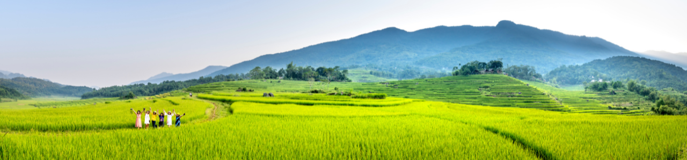

# C22-PS004 - Capstone Project (Farmer Nusantara)

## Hi there! 👋
<strong>Farmer Nusantara</strong> is a smartphone application was developed by utilizing deep learning and the application of GIS (Geographic Information System) which can help farmers identify plant diseases and facilitate disease tracking. The system aims to increase the production of Indonesian farmers, both in quantity and quality, so that they can fulfill the food supply chain in an effort to realize the second point of the SDG 2030 which includes food security and agricultural sustainability.

## Members
- (ML) M7004F0201 - Ahmad Reyhan Abdillah - Institut Teknologi Sepuluh Nopember
- (ML) M2214F1988 - Anggasta Tia Adi Kusuma - Universitas Islam Indonesia
- (MD) A2214F1984 - Fahrudin Nasikh Az Zuhdu - Universitas Islam Indonesia
- (MD) A2214F1991 - Alif Maulana Rizqi - Universitas Islam Indonesia
- (CC) C2369F2922 - Rahman Nurhidayat - STMIK Amik Bandung
- (CC) C7369F2923 - Rio Adiwijaya - STMIK Amik Bandung

## Repository Path
- <a href="https://github.com/farmer-nusantara/farmer-nusantara-mobile">Mobile</a>
- <a href="https://github.com/farmer-nusantara/farmer-nusantara-machine-learning">Machine Learning</a>
- <a href="https://github.com/farmer-nusantara/farmer-nusantara-api">API</a>
- <a href="https://github.com/farmer-nusantara/farmer-nusantara-cloud">Cloud</a>

## Tech Stack

  
  
  
  
  
  
  
  
  
  
  

